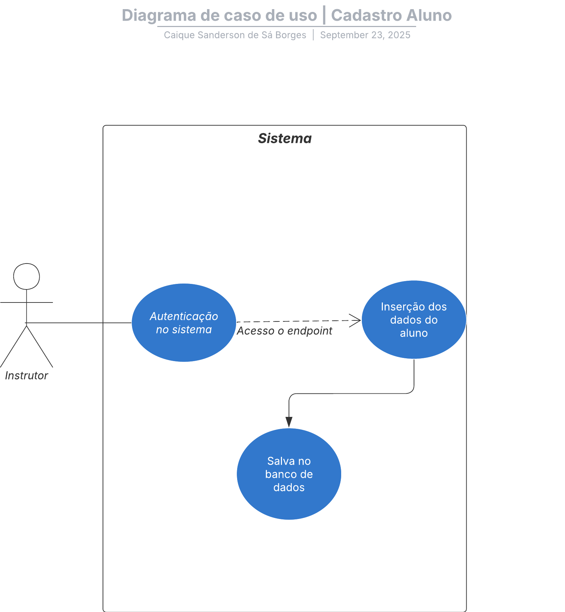
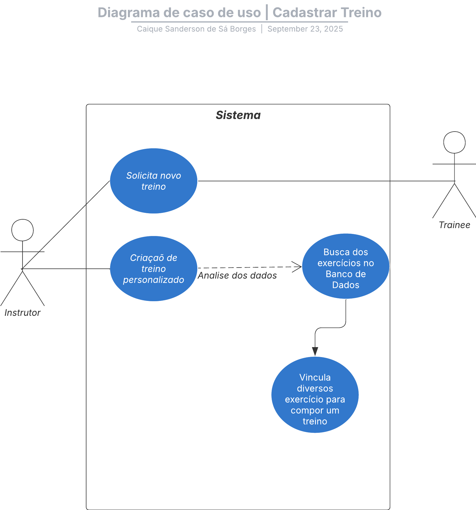
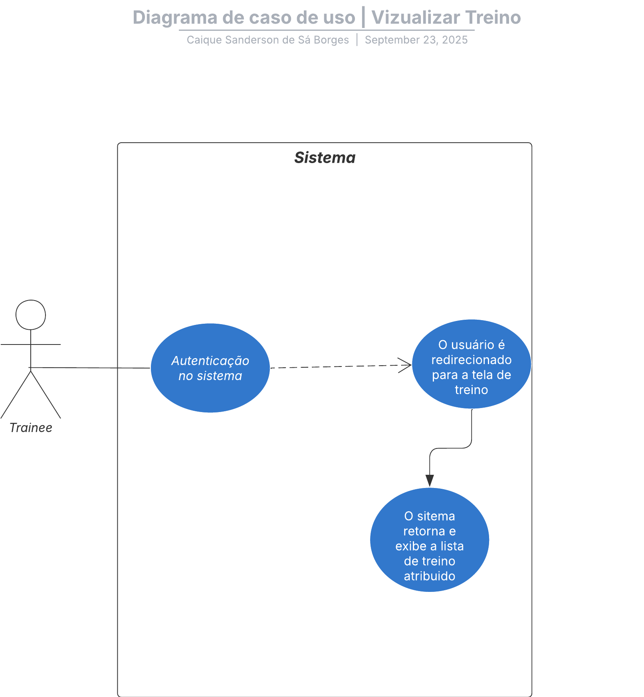

# Casos de Uso

## Lista de Casos de Uso
1. **Cadastro Aluno** → O Personal cria o cadastro do aluno e fica no aguardo na medicalHistory.
2. **Responder Anamnese** → O aluno responde questionário de saúde e objetivos.
3. **Cadastrar Exercício** → O personal adiciona novos exercícios no banco.
4. **Criar Treino** → O personal monta um treino a partir dos exercícios cadastrados.
5. **Consultar Treino** → O aluno visualiza seu treino e acessa vídeos de execução.

---

## 📊 Diagrama de Casos de Uso

